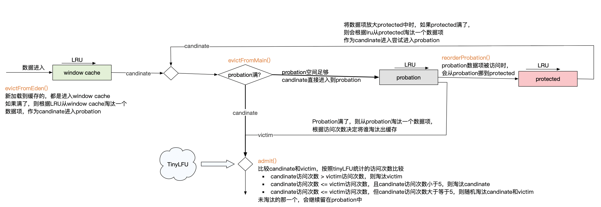

LFU 当缓存空间不足时，优先淘汰访问频率底的数据

LUR 当缓存空间不足时，优先淘汰最长时间未被访问的数据

W-TinyLFU

W-TinyLFU
Count-Min
Sketch算法解决了LFU中频率统计的问题，但是对于新加入数据更容易被淘汰、热极一时的数据项更难被淘汰出去的问题还存在，而这些问题正式LRU不会存在的。所以W-TinyLFU就是在TinyLFU前面增加了一个LRU缓存。它将缓存分成了两大部分：Window
cache和main cache，不同区域采用不同的淘汰策略

window cache：这部分是一个LRU缓存。当读入缓存的时候，都是先进入到window cache；当window cache满的时候，按照LRU淘汰出数据项，对于从window
cache淘汰出的数据项，再根据TinyLFU来决策是否进入到main cache中。在Caffine的实现中，window
cache默认是整个cache的1%，缓存数据是通过一个ConcurrentHashMap来实现，而window
cache的LRU策略是通过一个双端队列：accessOrderEdenDeque来实现的。

main cache：进一步划分为两部分

protected部分：在Caffine的实现中，这部分默认占main
cache的80%，其淘汰策略的实现是通过一个双端队列accessOrderProtectedDeque来实现的。这里面存放的其实是访问频率比较高的热数据，这是整个缓存的核心部分，是高缓存命中的保证。

probation部分：在Caffine的实现中，这部分默认占main
cache的20%，其淘汰策略的实现是通过一个双端队列accessOrderProbationDeque来实现的。里面存放的其实就是访问频率比较少的冷数据，即即将别淘汰出缓存的数据。