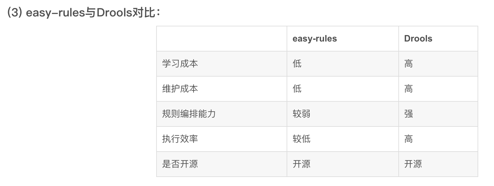

# 可提量中心

## 项目概述

是整体供应链中的一环，零部件采购系统-> 零部件库存管理 -> 生产管理 -> 成品库存管理 -> 货权管理 -> 销售库存管理 -> 前端销售系统
衔接小米全球成品代工厂和全球货权分配的库存管理模块

小米的成品库存管理是怎么做的

首先说明的一点是采购流程是如何做的

    对于一个商品，下多个采购单，有多个工厂来进行生产；同时支持预排产模式和非预排产模式

我们拿到的成品库存数据是：

    1. 某个采购单现货有多少，某个采购单 某天预排产数量是多少
    2. 无采购单维度，工厂的现货和预排产量

针对这些数据进行货权管理

    工厂每次给的都是可用的全量，而不是增量
    典型的使用场景：
        总量预占 + PO*日期的明细分配
        日期预占 + PO*日期的明细分配
        PO预占 + PO*日期的明细分配
        PO*日期直接占用
        总量占用

如何在同一个数据模型中，同时支持上述场景的使用，成为领域模型设计的一个难点

    解法：多维度 库存 占用+释放 的数据模型

        首先，是通过库存聚合，形成多维的库存数据（包块按照日期聚合、按照PO聚合、总量聚合）
    
        然后，将货权的分配过程，抽象为 占用过程，占用数据向上聚合，来保持多场景的校验能力；
    
        最后，货物出厂，抽象为释放过程，库存和占用都将被释放掉，保持对工厂给出库存的同步；

    通过这样一个模型设计，支持复杂多变的货权分配场景；

技术的相关设计点

    幂等，插入日志的方式实现幂等；日志的记录不是一次操作记录一条，而是将操作拆分到对需要操作的表进行数据变更的记录，
        这样设计的好处是可以通过完整的记录数据的变更历史, 通过这样的日志可以更好的进行数据校验、回溯、归档等；同时在业务侧需要的时候来提供流水的记录查询；
        同时这样设计会造成更多的数据写入，占用存储空间；
    乐观锁，通过版本号的递增，实现先查后改的数据不变性的控制；
    死锁问题，破坏环路等待的条件，通过参数排序，避免AB、BA的死锁场景；
        （其他可用的方式：mq，异步化处理，减少并发性（由于业务的特性，可能导致对同一条数据在短时间内大量调用）)

## 库存服务

内存配置缓存： 按地址寻仓，最优仓、次优仓列表；

内存库存缓存：次优仓列表不变的情况下，才可以查询缓存；查询缓存15s; 在下单扣减的时候进行拦截，保证不超卖；

Redis + 数据库持久化 + 库存校准程序
Hgetall hmget

中国机房：

中国区16台机器

下单、分货、查询：
99线 110ms左右
95线 40~60之间
平均响应时间 大部分在10ms以内，甚至不到1ms，部分接口20ms左右

接口QPS：
日常平均在 3000~4000之间

库存查询性能问题：

Redis QPS：
大促：8000 * 72(从) + 600 * (4)主 ，日常从节点数量减半
内存：内存使用率80%，每个节点配额13G，使用量10G多，共使用43G多

Redis主节点时延99线中国区的一般在几百微秒左右，有一台在4ms左右
Redis从节点时延99线中国区的一般在4微秒左右
Redis主节点缓存命令率 75% ~ 80%之间
Redis 99线，auth命令10微秒内，EVALSHA命令，450~500微秒

## 规则引擎

easy-rules（策略模块）

drools

Drools
特点：

基于Java的开源规则引擎，提供了一个强大的规则引擎和业务流程管理系统。
支持复杂的规则逻辑和模式匹配，并提供了丰富的规则语法和函数库。
提供了规则语言(DRL)和一个基于Java的API，高度可扩展。
支持基于规则的推理、决策和事件处理。
使用场景：

复杂的业务规则和决策逻辑场景：如风险评估、价格计算、优惠策略等。
事件驱动的系统：可处理实时事件流，并根据规则进行决策和处理。
业务流程管理：可用于管理和执行复杂的业务流程，如任务、评审等。

Aviator
特点：

高性能、轻量级
支持复杂的表达式计算和条件判断，并提供了丰富的内置函数和操作符
支持运算符重载
原生支持大整数和 BigDecimal 类型及运算，并且通过运算符重载和一般数字类型保持一致的运算方式。
原生支持正则表达式类型及匹配运算符 =~类 clojure 的 seq 库及 lambda 支持，可以灵活地处理各种集合
支持自定义函数接入以及各种定制选项
提供了一个简洁的表达式语言AviatorScript和一个基于Java的API
使用场景：

表达式计算：如数学计算、字符串处理等。
条件判断：如判断某个条件是否满足、选择合适的处理逻辑等。
数据处理和转换：大规模数据进行处理和转换，例如数据清洗、数据格式化等。

Easy Rules
特点：

简单易用，专注于处理简单的业务规则和决策逻辑。
提供了一种声明式的规则定义方式。
支持规则的优先级和条件判断，并提供了基于Java的API。
具有良好的可扩展性和灵活性，可轻松地集成。
使用场景：

简单的业务规则和决策逻辑：如审批流程、权限控制等。

**总结**：

Drools适用于处理复杂的业务规则和决策逻辑，Aviator适用于执行表达式计算和条件判断，Easy Rules适用于处理简单的业务规则和决策逻辑。